# BibleStudy State Machine Diagrams

Comprehensive documentation of all state machines in the BibleStudy iOS app, visualized using Mermaid `stateDiagram-v2` syntax.

## Table of Contents

- [1. Phase-Based User Flows](#1-phase-based-user-flows)
  - [1.1 Prayer Flow](#11-prayer-flow)
  - [1.2 Sermon Recording Flow](#12-sermon-recording-flow)
  - [1.3 Breathing Experience](#13-breathing-experience)
  - [1.4 Compline Evening Prayer](#14-compline-evening-prayer)
  - [1.5 Authentication Flow](#15-authentication-flow)
  - [1.6 Onboarding Flow](#16-onboarding-flow)
- [2. Service-Level State Machines](#2-service-level-state-machines)
  - [2.1 Audio Playback & Session Ownership](#21-audio-playback--session-ownership)
  - [2.2 Circuit Breaker](#22-circuit-breaker)
  - [2.3 Data Loading](#23-data-loading)
  - [2.4 Subscription/Entitlements](#24-subscriptionentitlements)
  - [2.5 Notification Authorization](#25-notification-authorization)
- [3. UI Component States](#3-ui-component-states)
  - [3.1 Bible Reader Selection](#31-bible-reader-selection)
  - [3.2 Reading Menu Navigation](#32-reading-menu-navigation)
  - [3.3 Ask Chat](#33-ask-chat)
  - [3.4 Memorization](#34-memorization)

---

## 1. Phase-Based User Flows

### 1.1 Prayer Flow

**Purpose:** Manages the AI-powered prayer generation experience with crisis detection and word-by-word reveal animation.

**Source:** `Features/Experiences/Prayer/Core/PrayerFlowState.swift`
d
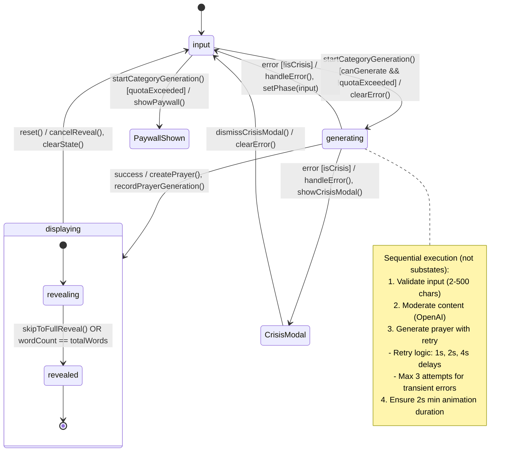

**Key Behaviors:**

- Crisis detection (self-harm) triggers hardcoded support resources modal
- Exponential backoff retry for transient failures (network, rate limit)
- Word-by-word reveal with punctuation-aware delays (0.7s base, +0.6s for periods)
- Quota tracking via `EntitlementService.recordPrayerGeneration()`

**Edge Cases:**

- Crisis modal prevents normal error dismissal flow
- Generation task is cancelled if view disappears
- Input validation (non-empty, <= 500 chars) happens before transition

---

### 1.2 Sermon Recording Flow

**Purpose:** Manages sermon recording, import, multi-step processing pipeline, and viewing.

**Source:** `Features/Sermon/Core/SermonFlowState.swift`

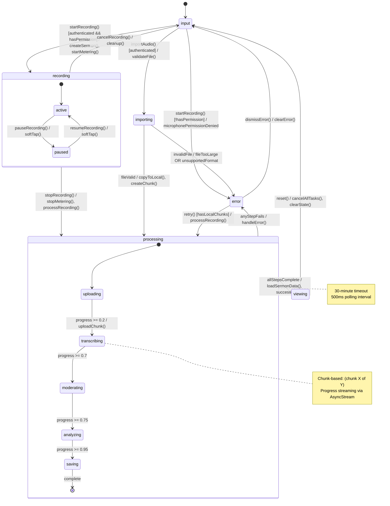

**Key Behaviors:**

- 10-minute audio chunks for large recordings
- Progress streaming via `AsyncStream` with 500ms polling
- Waveform samples generated per chunk (100 samples)
- Audio level metering during recording (100 samples buffer)

**Edge Cases:**

- Processing timeout after 30 minutes triggers error
- Local chunks preserved for retry on network failure
- Session refresh before authenticated operations

---

### 1.3 Breathing Experience

**Purpose:** Manages cyclic breathing exercises with configurable patterns and visual/haptic feedback.

**Source:** `Features/Experiences/Breathe/Core/BreathingState.swift`

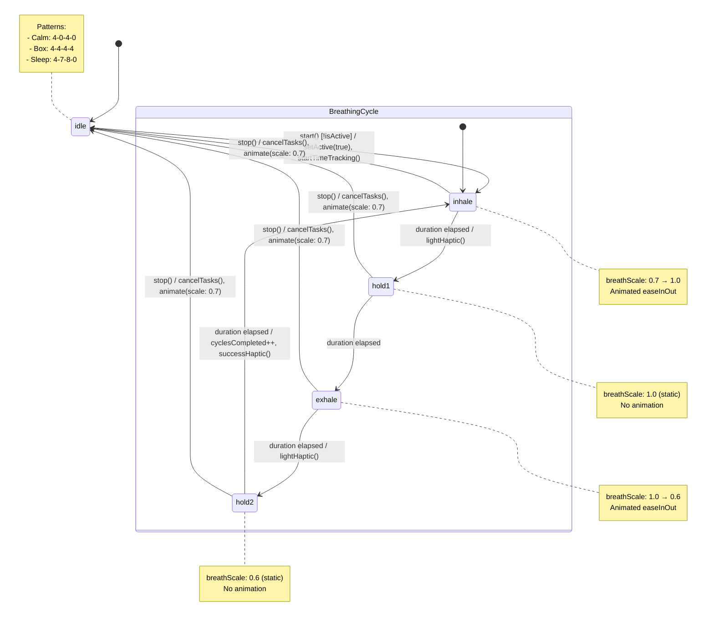

**Key Behaviors:**

- Pattern selection only allowed when `!isActive`
- Zero-duration phases are skipped automatically
- Cycle progress calculated as `(phaseOffset + elapsed) / totalCycle`
- Time tracking runs independently at 100ms intervals

**Edge Cases:**

- ComplineBreathingState variant uses fixed 4-7-8 pattern
- Tasks cancelled immediately on `stop()` to prevent zombie animations

---

### 1.4 Compline Evening Prayer

**Purpose:** Guides users through the traditional evening prayer liturgy with sequential sections.

**Source:** `Features/Experiences/Compline/ComplineView.swift`

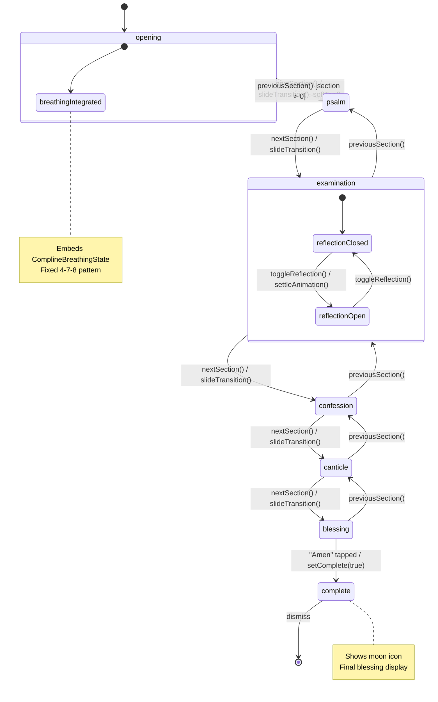

**Key Behaviors:**

- Linear progression through 6 sections
- Back navigation allowed except from first section
- Examination section has optional text reflection input
- Opening section integrates `ComplineBreathingState`

**Edge Cases:**

- Keyboard dismissed on section transitions
- Section visibility animated on appear

---

### 1.5 Authentication Flow

**Purpose:** Manages sign-in, sign-up, password reset, email confirmation, and biometric enrollment.

**Source:** `Features/Auth/AuthViewModel.swift`

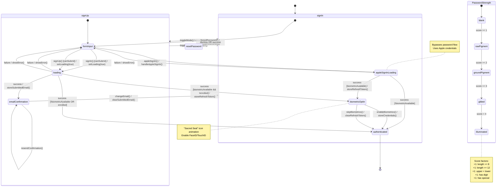

**Key Behaviors:**

- Biometric opt-in shown after successful sign-in if available
- Refresh token temporarily stored for biometric enrollment
- Password strength calculated in real-time with visual indicator
- Email confirmation allows resend without losing context

**Edge Cases:**

- Biometric sign-in with expired token falls back to password
- Form validation prevents submission with invalid data
- Apple Sign In bypasses password flow entirely

---

### 1.6 Onboarding Flow

**Purpose:** Collects user preferences to personalize the app experience with mode and goal recommendations.

**Source:** `Features/Onboarding/OnboardingView.swift`

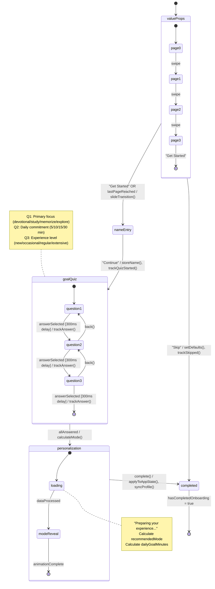

**Key Behaviors:**

- Skip sets defaults: `{focus: "devotional", time: "10", level: "occasional"}`
- Mode recommendation: Study if `focus == "study"` OR `time == "30"` OR `level == "extensive"`
- Quiz answers auto-advance after 300ms selection delay
- Analytics tracked at each step

**Edge Cases:**

- Name entry is optional (can continue with empty)
- Back navigation within quiz (except Q1)
- Daily goal synced to `ProgressService` on completion

---

## 2. Service-Level State Machines

### 2.1 Audio Playback & Session Ownership

**Purpose:** Manages audio playback lifecycle with TTS generation, sleep timers, verse synchronization, and coordinated audio session ownership across multiple producers.

**Source:** `Core/Services/Audio/AudioService.swift`

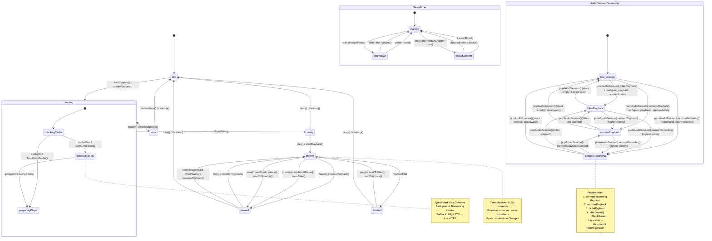

**Key Behaviors:**

- Progressive loading: start playback after first 3 verses
- TTS fallback chain: Edge neural TTS → Local AVSpeechSynthesizer
- Sleep timer modes: countdown (minutes) or end-of-chapter
- Verse boundary synchronization via `CMTime` observers
- **Stack-based audio session ownership**: Multiple producers can claim the session; highest priority mode wins
- **Idempotent reconfiguration**: Session only reconfigured when target mode differs from current

**Audio Session Modes (Priority Order):**

| Mode | Priority | Category | AVAudioSession.Mode | Options |
| ---- | -------- | -------- | ------------------- | ------- |
| `sermonRecording` | 3 (highest) | `.playAndRecord` | `.default` | `.defaultToSpeaker`, `.allowBluetoothHFP` |
| `sermonPlayback` | 2 | `.playback` | `.spokenAudio` | none |
| `biblePlayback` | 1 | `.playback` | `.spokenAudio` | none |
| `idle` | 0 (lowest) | - | - | Session deactivated |

**Edge Cases:**

- Audio session interruptions save/restore playback state
- Route changes (headphone unplug) trigger pause
- Invalid cache deleted and regenerated automatically
- Background task protection for TTS generation (10-30s window)
- **Session pop with empty stack**: Deactivates session with `.notifyOthersOnDeactivation`
- **Duplicate owner push**: Removes existing claim before adding new one

---

### 2.2 Circuit Breaker

**Purpose:** Prevents cascading failures during AI service outages by failing fast.

**Source:** `Core/Services/AI/CircuitBreaker.swift`

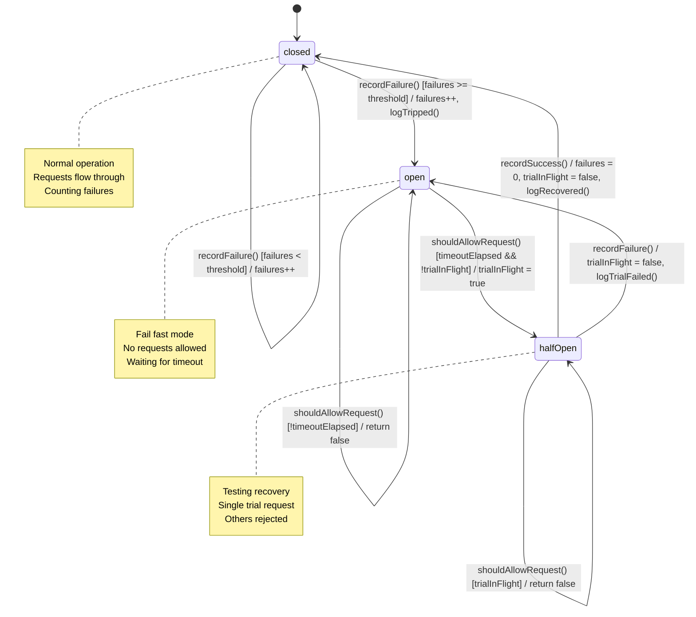

**Configuration:**

- `failureThreshold`: 5 consecutive failures
- `resetTimeout`: 60 seconds

**Key Behaviors:**

- Actor isolation ensures thread-safe state transitions
- Single trial request allowed in halfOpen (via `trialRequestInFlight` flag)
- `timeUntilRetry` computed property for UI feedback
- Manual `reset()` available for admin/testing

**Edge Cases:**

- Success in closed state resets failure count
- Failure in open state is no-op (already open)
- `CircuitBreakerError.circuitOpen(retryAfter:)` includes remaining timeout

---

### 2.3 Data Loading

**Purpose:** Manages app initialization data loading with progress tracking.

**Source:** `Core/Services/Bible/DataLoadingService.swift`

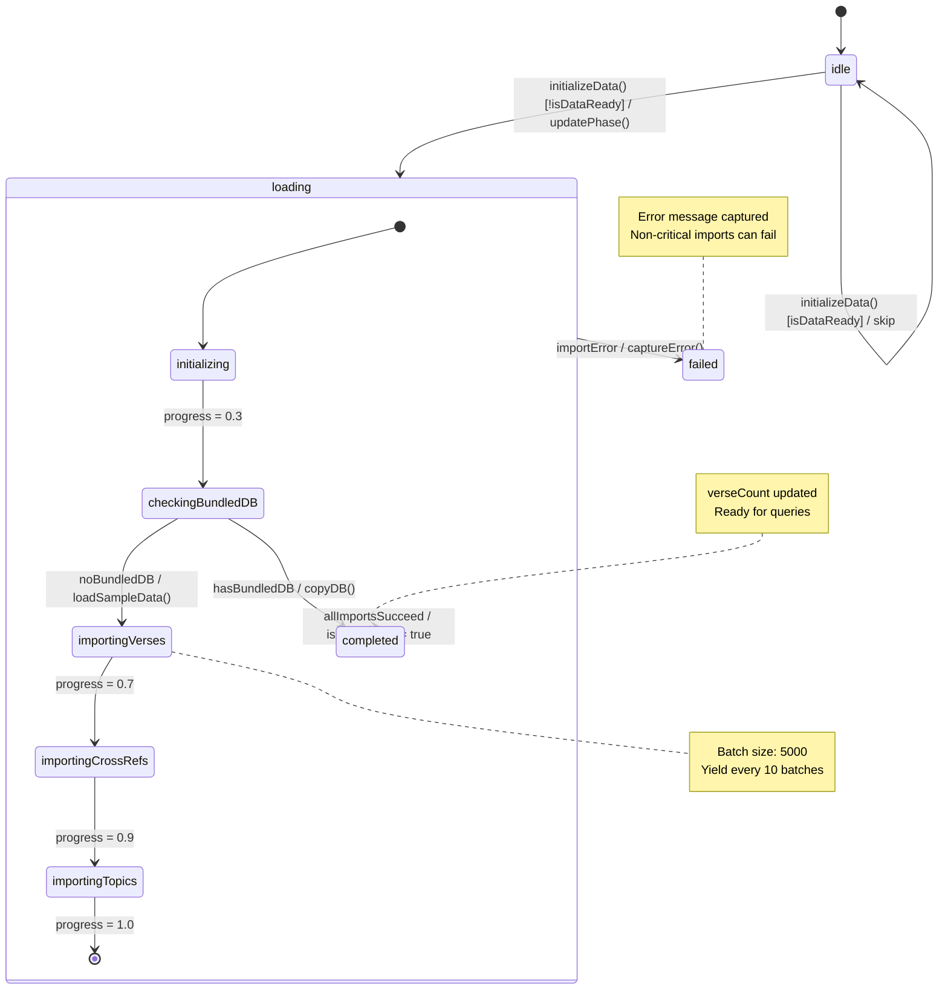

**Key Behaviors:**

- Bundled database used if available (skip imports)
- Sample data fallback: kjv_sample.json, crossrefs_sample.json, topics_sample.json
- Batch processing with main thread yields every 10 batches
- Non-critical imports (cross-refs, topics) don't block completion

**Edge Cases:**

- Already loaded data skips re-initialization
- Progress description changes with each phase
- Error state captures localized description

---

### 2.4 Subscription/Entitlements

**Purpose:** Manages subscription tiers, feature gating, and paywall triggering.

**Sources:** `Core/Services/Purchase/PurchaseService.swift`, `Core/Services/Purchase/EntitlementService.swift`

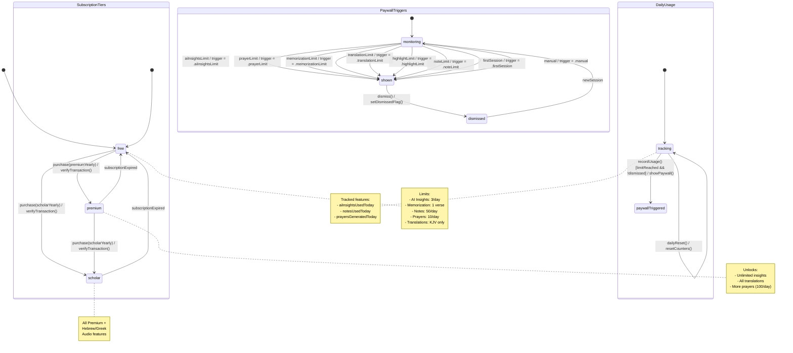

**Key Behaviors:**

- Transaction listener continuously monitors StoreKit updates
- JWS signature verification on purchases
- Daily usage resets at midnight UTC
- Paywall dismissal persists for session (per feature)

**Edge Cases:**

- Highlights now unlimited (changed from limited)
- `canAccess()` respects session dismissal flags
- Expired subscriptions detected via `expirationDate` check

---

### 2.5 Notification Authorization

**Purpose:** Manages notification permissions and scheduling following HIG guidelines.

**Source:** `Core/Services/Notification/NotificationService.swift`

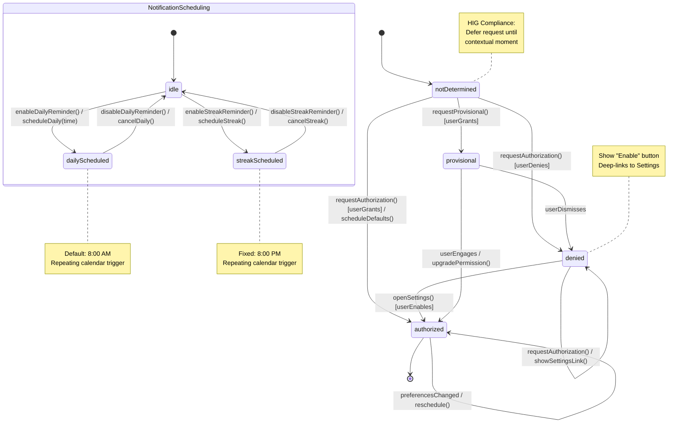

**Key Behaviors:**

- Permission request deferred until after first session
- Contextual messaging explains value before requesting
- Settings deep-link provided when denied
- Silent failure logging (errors don't crash)

**Edge Cases:**

- Foreground notification presentation handled via delegate
- `.notificationTapped` posted for navigation handling
- Achievement notifications are one-time (not repeating)

---

## 3. UI Component States

### 3.1 Bible Reader Selection

**Purpose:** Manages verse selection modes and context menu for Bible reader interactions.

**Source:** `Features/Bible/ViewModels/BibleReaderViewModel.swift`

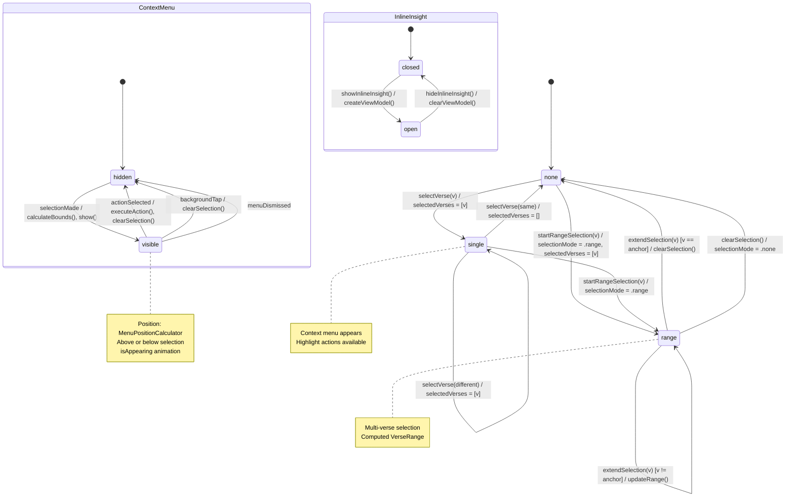

**Key Behaviors:**

- Single tap toggles selection in single mode
- Long press initiates range selection mode
- Context menu positioned using `MenuPositionCalculator`
- Inline insight panel manages its own view model

**Edge Cases:**

- `existingHighlightColorForSelection` computed for UI display
- `lastHighlightAction` stored for undo capability
- Flash animation (`flashVerseId`) for search navigation

---

### 3.2 Reading Menu Navigation

**Purpose:** Manages reading menu sheet navigation between views.

**Source:** `Features/Bible/Views/ReadingMenu/ReadingMenuState.swift`

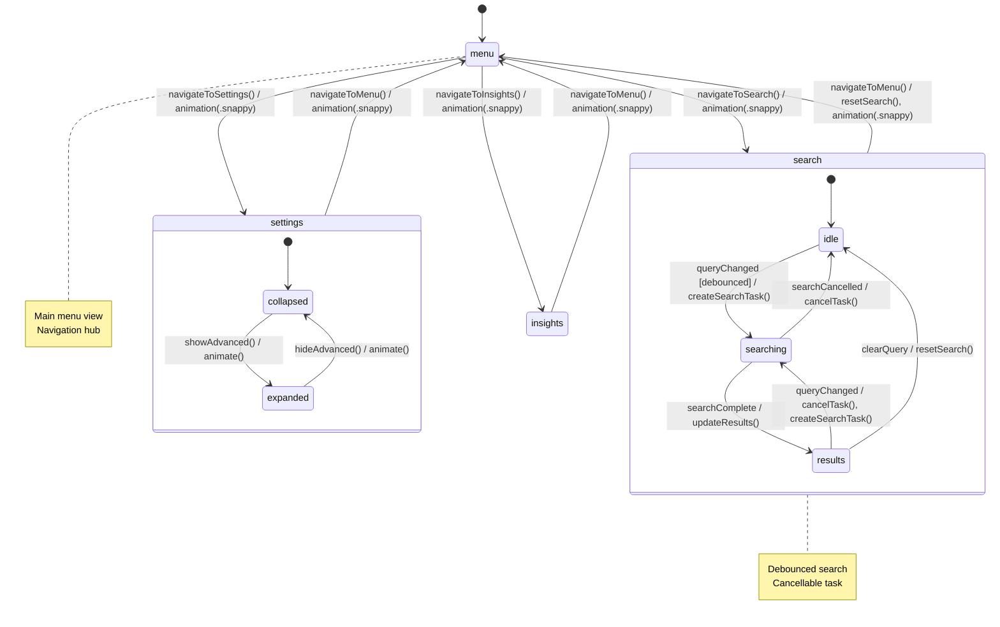

**Key Behaviors:**

- All navigation uses `.snappy(duration: 0.3, extraBounce: 0)` animation
- Search reset on returning to menu
- Search task is cancellable (stored as `searchTask`)
- Advanced settings toggle in settings view

**Edge Cases:**

- Query changes cancel in-flight search and start new
- `isSearching` flag tracks loading state

---

### 3.3 Ask Chat

**Purpose:** Manages AI chat with input validation, moderation, guardrails, and uncertainty tracking.

**Source:** `Features/Ask/AskViewModel.swift`

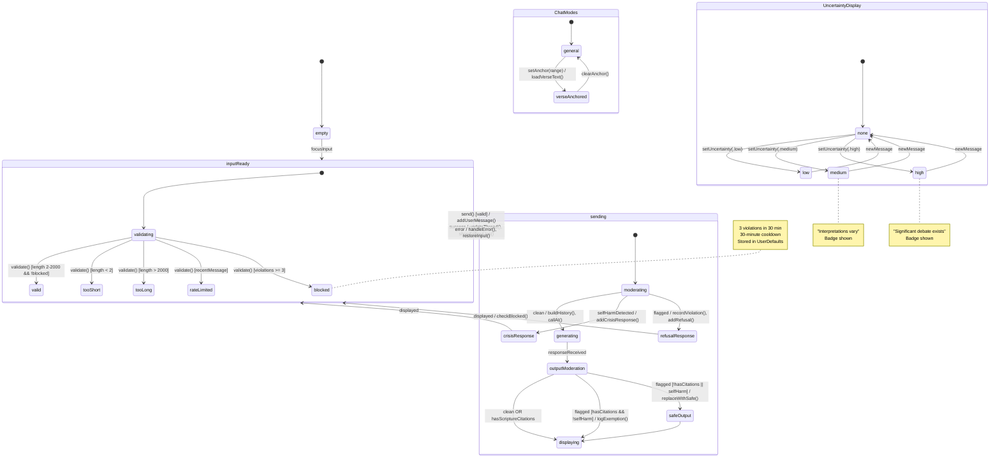

**Key Behaviors:**

- Input moderation via FREE OpenAI Moderation API
- Crisis detection triggers hardcoded support response
- Citation validation filters hallucinated references
- Uncertainty downgrade if citations missing but verses mentioned

**Edge Cases:**

- Scripture study exemption: flagged output allowed if has valid citations (self-harm NEVER exempted)
- Violation tracking with 30-minute rolling window
- Follow-up suggestions generated by AI
- Token budget management via conversation windowing

---

### 3.4 Memorization

**Purpose:** Manages verse memorization with SM-2 spaced repetition, hint progression, and mastery tracking.

**Sources:** `Core/Services/Study/MemorizationService.swift`, `Features/Memorize/MemorizeView.swift`

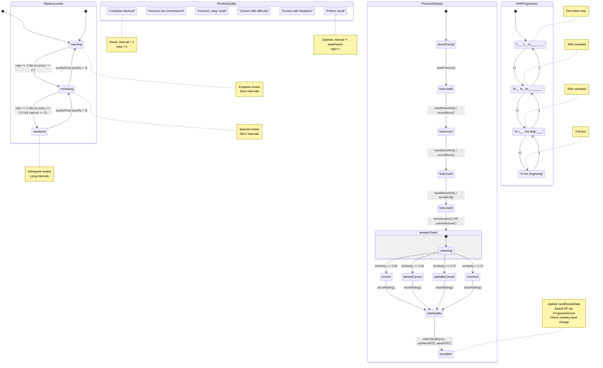

**Key Behaviors:**

- SM-2 algorithm for spaced repetition scheduling
- Hint levels 0-3 with progressive text reveal
- Answer similarity checked via string comparison
- XP awarded on completion via `ProgressService`

**Edge Cases:**

- Quality < 3 resets interval to 1 day, repetitions to 0
- Ease factor has minimum of 1.3
- Mastery level changes trigger celebration
- Due items computed from `nextReviewDate`

---

## Appendix: State Enum Reference

### Phase-Based Flows

| Component | Enum | Values |
| --------- | ---- | ------ |
| Prayer | `PrayerFlowPhase` | input, generating, displaying |
| Sermon | `SermonFlowPhase` | input, recording, importing, processing(ProcessingStep), viewing, error(SermonError) |
| Sermon Processing | `ProcessingStep` | uploading(Double), transcribing(Double, Int, Int), moderating, analyzing, saving |
| Sermon Status | `SermonStatus` | pending, processing, ready, degraded, error |
| Breathing | `BreathingPhase` | idle, inhale, hold1, exhale, hold2 |
| Auth | (implicit) | signIn, signUp, resetPassword, emailConfirmation, biometricOptIn |
| Auth Password | `PasswordIllumination` | blank, rawPigment, groundPigment, gilded, illuminated |
| Onboarding | `OnboardingStep` | valueProps, nameEntry, goalQuiz, personalization |

### Service-Level

| Component | Enum | Values |
| --------- | ---- | ------ |
| Audio | `PlaybackState` | idle, loading, ready, playing, paused, finished, error |
| Audio Session | `AudioSessionMode` | idle, biblePlayback, sermonPlayback, sermonRecording |
| Circuit Breaker | `State` | closed, open, halfOpen |
| Data Loading | `DataLoadingPhase` | idle, loading(String, Double), completed, failed(String) |
| Subscription | `SubscriptionTier` | free, premium, scholar |
| Notification | `UNAuthorizationStatus` | notDetermined, denied, authorized, provisional, ephemeral |

### UI Components

| Component | Enum | Values |
| --------- | ---- | ------ |
| Bible Reader | `BibleSelectionMode` | none, single, range |
| Reading Menu | `MenuView` | menu, search, settings, insights |
| Ask Chat | `ChatMode` | general, verseAnchored |
| Ask Validation | `InputValidation` | valid, tooShort, tooLong, rateLimited, blocked |
| Ask Response | `ResponseType` | answer, clarification, crisisSupport, refusalSafety |
| Ask Uncertainty | `UncertaintyLevel` | low, medium, high |
| Memorization | `MasteryLevel` | learning, reviewing, mastered |
| Memorization | `AnswerResult` | correct, almostCorrect(Double), partiallyCorrect(Double), incorrect |
| Memorization | `ReviewQuality` | 0-5 (completeBlackout to perfectRecall) |

---

*Generated for BibleStudy iOS App - Documentation of state machine architecture*
